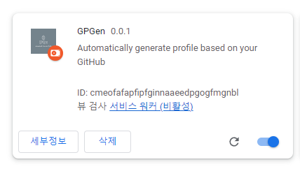
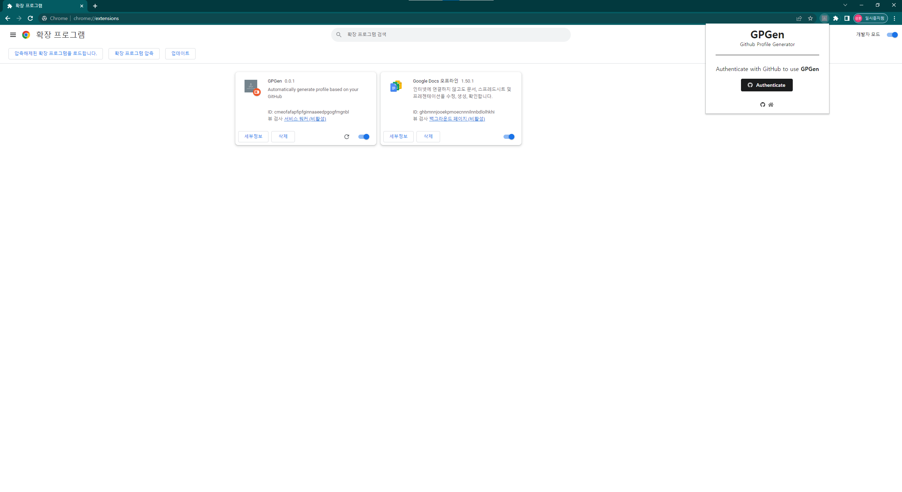
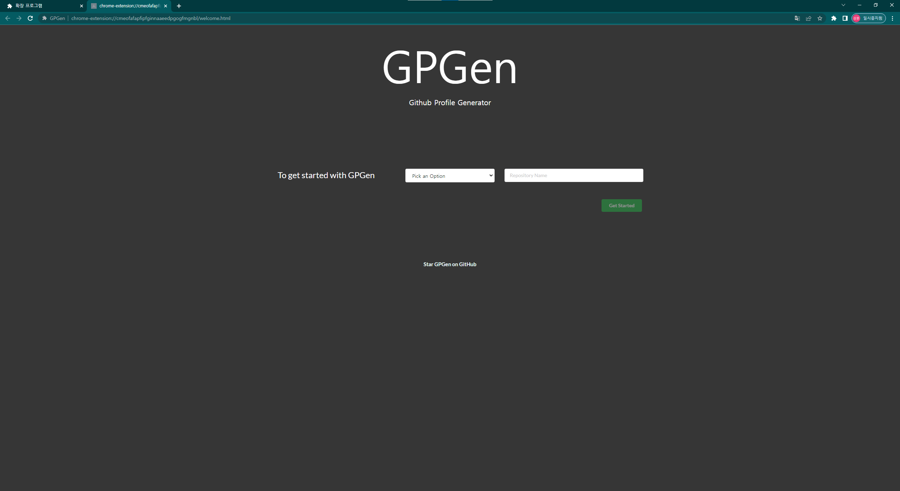
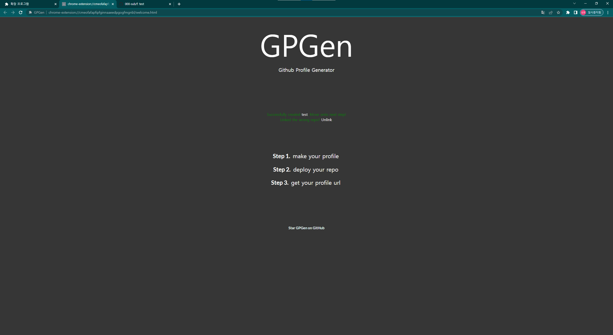
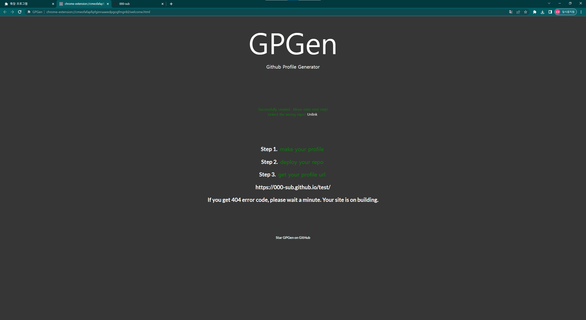
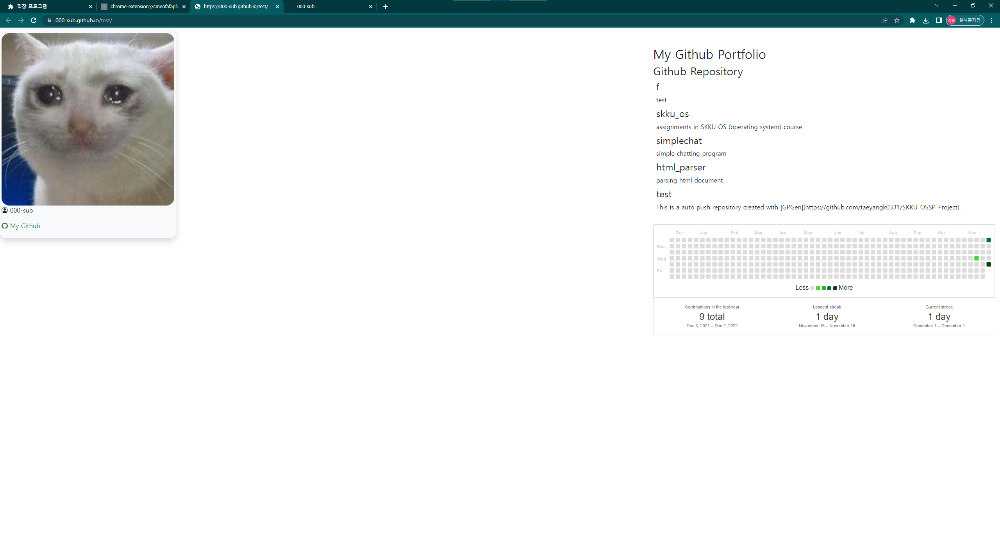

<h1 align="center">
  
  <br>
    GPGen - Automatically generate profile based on GitHub.
  <br>
  <br>
</h1>

<p align="center">
  <a href="LICENSE"></a>
</p>

</br>

## Contributors

<!-- ALL-CONTRIBUTORS-LIST:START - Do not remove or modify this section -->
<!-- prettier-ignore-start -->
<!-- markdownlint-disable -->
<table>
  <tbody>
    <tr>
      <td align="center"><a href="https://github.com/000sub"><br /><sub><b>000sub</b></sub></a><br /></td>
      <td align="center"><a href="https://github.com/taeyangk0331"><br /><sub><b>taeyangk0331</b></sub></a><br /></td>
      <td align="center"><a href="https://github.com/Mminy62"><br /><sub><b>Mminy62</b></sub></a><br /></td>
  </tbody>
</table>

<!-- markdownlint-restore -->
<!-- prettier-ignore-end -->

<!-- ALL-CONTRIBUTORS-LIST:END -->

<br/>

## 목차

1. [What is GPGen?](#what-is-gpgen)
2. [Quick start](#quick-start)
3. [설치 및 연동](#설치-및-연동how-to-set-it-up)
4. [링크 및 문서](#링크-및-문서)
   <br />
   <br />


<!--- 소개 --->

## What is GPGen?

<p>
  GPGen(Github Profile Generator)는 사용자의 깃허브 레포지토리를 기반으로 프로필 웹사이트를 생성하는 chrome extension application입니다. 성균관대학교 오픈소프트웨어실습 Assignment 2에서 아이디어를 얻었으며, 
  오픈 소스 <a href="https://github.com/BaekjoonHub/BaekjoonHub">BaekjoonHub</a>를 fork하여 제작된 프로젝트입니다.
</p>

<br />
<br />

<!-- Quick Start -->

## Quick start

```bash
git clone https://github.com/taeyangk0331/SKKU_OSSP_Project.git
```
    
크롬 > 도구 더보기 > 확장프로그램 > 개발자 모드 > 압축해제된 확장 프로그램을 로드합니다 > SKKU_OSSP_Project 폴더를 선택합니다.
<br><br>


<br>
다음과 같은 이미지가 보인다면 크롬 브라우저에 정상적으로 연동된 상태입니다.
<br><br>
<br><br>
확장 프로그램을 실행시킬 경우 팝업창이 출력됩니다. Authenticate 버튼을 눌러 Github 인증을 진행합니다. <br><br>
<br><br>
인증이 완료되었을 경우, 다음과 같은 창이 출력됩니다. Pick an Option > Create a new Repository를 선택한 후 생성할 repository의 이름을 입력한 뒤, Get Started 버튼을 클릭합니다.

### 주의: 이미 존재하는 repository를 연동하고 싶은 경우, 옵션을 변경해주세요. <br><br>

<br><br>
Step 1-3을 차례대로 클릭하면 사용자의 Github repository를 기반으로 한 프로필 웹 페이지가 자동으로 생성되며, url이 반환됩니다.
각 step을 클릭한 후 작업이 완료된 것을 확인한 뒤 다음 step을 진행해주세요. 작업이 완료되었다면 글자가 초록색으로 변합니다.
<br><br><br><br>
웹 페이지를 생성하는 데 다소 시간이 걸릴 수 있습니다. 만약 url에 접속 시도 시 404 에러가 발생한다면, 잠시 후 다시 접속을 시도해주세요.
<br><br><br><br>
이제 완성된 프로필 웹 사이트를 확인할 수 있습니다.
<br/>
<br/>

<!--- 설치 및 연동 --->

## 설치 및 연동(How to set it up)

<ol>
  <li>크롬 > 도구 더보기 > 확장프로그램 > 개발자 모드 > 압축해제된 확장 프로그램을 로드합니다</li>
  <li>팝업창의 - "Setup Hook" 버튼을 누르면 Repository 연동 화면이 표시됩니다.</li>
  <li>신규 혹은 기존의 Repository를 선택하면 GPGen과의 연동이 완료됩니다.</li>
  <li>이후 차례로 step 버튼을 누르면, profile url을 반환합니다.</li>
</ol>
<br />
<br />

## 유튜브 설명
git clone https://github.com/taeyangk0331/SKKU_OSSP_Project.git


<!--- 링크 및 문서 --->

## 링크 및 문서

<table>
  <tr>
    <td align="center">
      <a href="https://github.com/taeyangk0331/SKKU_OSSP_Project/issues" title="버그신고">
          
      </a><br/><sub><b>버그 신고</b></sub>
    </td>
  </tr>
</table>

<br />
<br />
